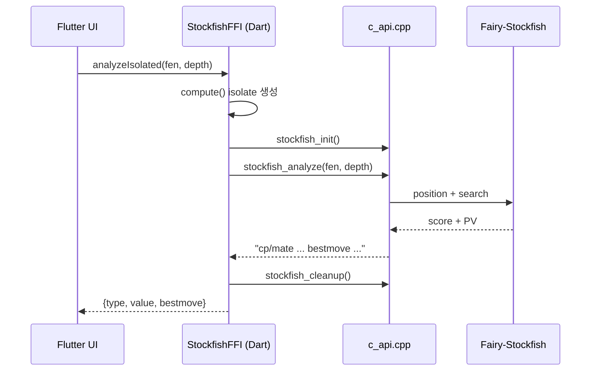
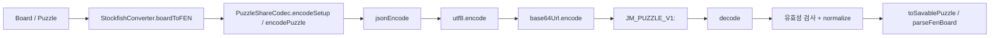

# 장기한수 (Janggi Master)

Flutter 기반 장기(한국 장기) 앱 프로젝트입니다.  
실시간 AI 대국, 오프라인 2인 대국, 이어하기, 묘수풀이(기보 기반/사용자 생성) 기능을 제공합니다.

## 앱 소개

- 프로젝트명: `janggi_project`
- 앱 디렉터리: `janggi_master/`
- 목표:
  - 모바일에서 빠르고 안정적인 장기 플레이 경험 제공
  - Fairy-Stockfish 기반 AI 대국 및 힌트 기능 제공
  - 실전 기보(GIB)에서 묘수 장면을 추출해 콘텐츠화

## 주요 기능

- AI 대국 (난이도별)
- 오프라인 2인 대국
- 배치 이어하기 (AI)
- 묘수풀이 모드 (기보 기반)
- 나만의 묘수 생성/저장
- 공유 코드로 퍼즐 내보내기/가져오기

## 기술 스택

- 앱 프레임워크: `Flutter`, `Dart (SDK ^3.6.1)`
- 상태 관리: `Provider`
- 로컬 저장: `SharedPreferences`
- 사운드: `audioplayers`
- 엔진 연동: `Dart FFI` + `C++`
- 장기 AI 엔진: `Fairy-Stockfish` 기반 커스텀 빌드
- 플랫폼: Android 중심, Windows 포함 멀티플랫폼 구조

## FFI 통신 구조 (Dart <-> C++)

실행 경로는 `Dart 래퍼 -> FFI exported C API -> Fairy-Stockfish core`로 구성됩니다.

| Dart 레이어 | C/C++ export | 역할 |
| --- | --- | --- |
| `StockfishFFI.init()` | `stockfish_init()` | 엔진/variant 초기화, 옵션 기본값 세팅 |
| `StockfishFFI.command(cmd)` | `stockfish_command(const char*)` | UCI 명령 전송/응답 수신 |
| `StockfishFFI.analyze(fen, depth)` | `stockfish_analyze(const char*, int)` | 점수(`cp`/`mate`)와 `bestmove` 직접 추출 |
| `StockfishFFI.cleanup()` | `stockfish_cleanup()` | 스레드/상태 정리 |

- 스레드 안전성: `engine/src/c_api.cpp`에서 전역 mutex(`g_engine_mutex`)로 보호
- UI 응답성: `analyzeIsolated`, `getBestMoveIsolated`로 isolate에서 분석 수행
- 분석 응답 정규화: `"cp 300 bestmove e9f9"` / `"mate 5 bestmove a1a2"` 형태를 Dart Map으로 파싱



## 가장 오래 걸린 작업: 기존 GIB에서 묘수풀이 자동 추출

프로젝트에서 가장 시간이 많이 든 부분은 **기존 경기 기보(GIB)에서 묘수 시작점을 자동 추출하는 파이프라인**이었습니다.

### 왜 어려웠는가

- GIB 좌표 포맷이 단순하지 않음
  - 좌표가 `YX(rank,file)` 형식이고, 일부 기보는 `10`을 `0`으로 표기
  - 수 기호/주석이 섞여 있어 좌표 정규화 필요
- 수순 중간 보드 복원 필요
  - 특정 수까지 정확히 리플레이해 해당 시점 보드를 재구성해야 함
- 묘수 시작점 탐지 로직 난이도
  - 단순히 마지막 수를 쓰는 것이 아니라, "어디서부터 외통 수순이 시작되는가"를 판별해야 함

### 어떻게 해결했는가

- `lib/utils/gib_parser.dart`
  - GIB 수를 정규화/파싱 (`parseGibMove`)
  - 수순 리플레이로 임의 시점 보드 복원 (`replayMovesToPosition`)
  - 종반 구간을 **역방향으로 탐색**하면서 엔진 평가 추적
  - `cp -> mate` 전환 지점을 묘수 시작점으로 결정 (`findPuzzleStartPosition`)
- `Stockfish` 분석은 isolate 경로(`analyzeIsolated`)를 사용해 UI 블로킹 최소화
- 실패 케이스 대비 fallback 기준(전환점 미검출 시 안전한 시작 비율 적용)도 함께 구성

## 나만의 묘수 텍스트 공유 기능: 해결 과정

요청이 많았던 기능이 "퍼즐을 이미지가 아니라 **텍스트로 공유**"하는 것이었습니다.  
메신저/노트에 붙여넣어 주고받을 수 있도록 다음 방식으로 해결했습니다.

### 설계

- 공유 포맷: `JM_PUZZLE_V1:<base64url(json)>`
- 버전/타입 포함:
  - `setup` (배치만 공유)
  - `full` (배치 + 정답 수순까지 공유)
- 핵심 필드:
  - `fen`, `toMove`, `solution`, `mateIn`, `title`

### 공유 코드 Payload 스키마 (Base64URL JSON)

공유 포맷은 `JM_PUZZLE_V1:<base64url(json)>`이며, Base64URL 내부 JSON 스키마는 아래와 같습니다.

| 키 | 타입 | 필수 | 설명 |
| --- | --- | --- | --- |
| `v` | `int` | 선택 | 포맷 버전 (`decode` 시 기본값 `1`) |
| `t` | `string` | 선택 | `setup` 또는 `full` |
| `title` | `string` | 선택 | 퍼즐 제목 (`trim`) |
| `fen` | `string` | 필수 | 장기 배치 FEN (빈 문자열이면 예외) |
| `toMove` | `string` | 선택 | `red` 또는 `blue` (`_normalizeToMove`) |
| `solution` | `string[]` | 선택 | 정답 수순 (없으면 `[]`) |
| `mateIn` | `int` | 선택 | 없으면 `solution` 길이 기반 자동 계산 |

`decode`는 prefix가 없는 경우 raw JSON 입력도 허용합니다. 또한 `solution`이 비어있지 않으면 `t`가 없어도 `full`로 보정합니다.

### 인코딩/디코딩 파이프라인



### 구현

- `lib/utils/puzzle_share_codec.dart`
  - `encodeSetupFromBoard`, `encodePuzzle`, `decode`
  - 코드 유효성 검증 및 FEN 파싱(`parseFenBoard`)
  - 저장 가능한 퍼즐 payload 변환(`toSavablePuzzle`)
- `lib/screens/custom_puzzle_editor_screen.dart`
  - 현재 배치를 공유 코드로 복사
  - 공유 코드 붙여넣기/클립보드 읽기 후 즉시 불러오기
  - full 퍼즐인 경우 "배치만 불러오기 / 퍼즐로 바로 가져오기" 분기 처리
- `lib/screens/puzzle_list_screen.dart`
  - 저장된 나만의 묘수에서 공유 코드 복사
- `lib/services/custom_puzzle_service.dart`
  - `SharedPreferences`(`custom_puzzles_v1`)에 퍼즐 저장/삭제

## FEN/좌표 변환 규약 (전문 요약)

`lib/utils/stockfish_converter.dart` 기준으로 장기 변형(Fairy-Stockfish) 규약을 다음처럼 고정했습니다.

- 보드 좌표계:
  - Flutter: `file 0..8`, `rank 0..9` (아래 -> 위)
  - UCI: `a..i`, `1..10`
  - 매핑: `uciRank = flutterRank + 1` (직접 매핑)
- 진영 매핑:
  - `Blue(초)` -> `White`(대문자 FEN), 선공(`w`)
  - `Red(한)` -> `Black`(소문자 FEN), 후공(`b`)
- 기물 문자 매핑:
  - `general -> k`
  - `guard -> a`
  - `horse -> n`
  - `elephant -> b`
  - `chariot -> r`
  - `cannon -> c`
  - `soldier -> p`
- FEN 레이아웃:
  - rank 10 -> rank 1 순서로 직렬화
  - 꼬리 필드 고정: `- - 0 1`

공유 코드에서 FEN 역파싱(`parseFenBoard`) 시에는 `fenRank -> boardRank = 9 - fenRank` 변환으로 Flutter 보드 좌표를 복원합니다.

## 대표 오류 해결 요약

- GIB 좌표계 오해(`XY` 해석)로 배치가 깨지는 문제를 `YX` 변환식으로 수정
- UCI `multipv` 파싱 시 숫자("1", "2")가 수로 인식되는 버그 수정
- 궁성 대각선 체크 판정에서 "기물 색" 기준 판정을 "실제 좌표 기준"으로 교체
- 묘수풀이 화면 엔진 초기화 누락(`Stockfish not initialized`) 해결

## 프로젝트 구조

```text
janggi_project/
├─ README.md
└─ janggi_master/
   ├─ lib/                # Flutter UI/게임 로직
   ├─ engine/             # Fairy-Stockfish 기반 C++ 엔진 소스
   ├─ assets/             # 이미지/사운드/기보/퍼즐 데이터
   ├─ android/            # Android 설정
   ├─ windows/            # Windows 설정
   └─ tools/              # 배지/에셋 생성 스크립트
```

## 실행 방법

```bash
git clone https://github.com/Sungi-Hwang/janggi_project.git
cd janggi_project/janggi_master
flutter pub get
flutter run
```

Windows 실행:

```bash
flutter run -d windows
```

## 라이선스 참고

- 엔진 코드는 Fairy-Stockfish 기반이며, 해당 엔진 라이선스(GPL 계열)를 따릅니다.
- 세부 내용은 `janggi_master/engine/Copying.txt`를 참고하세요.
